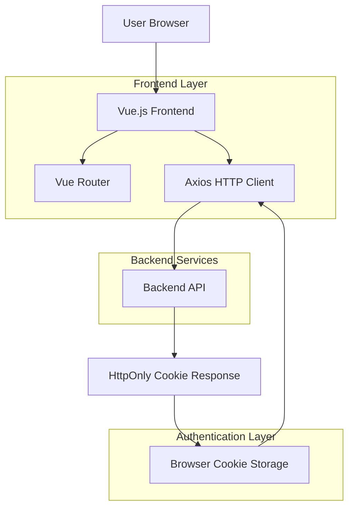

## 1. Architecture design



## 2. Technology Description

- **Frontend**: Vue.js@3 + Vue Router@4 + Pinia + Axios
- **Styling**: TailwindCSS@3
- **Build Tool**: Vite
- **HTTP Client**: Axios con interceptores
- **State Management**: Pinia para estado global
- **Validation**: Vuelidate o similar
- **Backend**: API REST externa (no incluida en este scope)

## 3. Route definitions

| Route | Purpose | Auth Required |
|-------|---------|---------------|
| / | Landing page o redirección a login | No |
| /login | Página de autenticación | No |
| /register | Página de registro de nuevos usuarios | No |
| /dashboard | Panel principal post-login | Sí |
| /profile | Gestión de perfil de usuario | Sí |
| /protected | Ejemplo de página protegida | Sí |
| /logout | Endpoint de cierre de sesión | Sí |

## 4. API definitions

### 4.1 Authentication APIs

#### Login
```
POST /api/auth/login
```

Request:
| Param Name | Param Type | isRequired | Description |
|------------|------------|------------|-------------|
| email | string | true | Email del usuario |
| password | string | true | Contraseña del usuario |

Response Headers:
```
Set-Cookie: auth-token=xxx; HttpOnly; Secure; SameSite=Strict; Path=/
```

Response Body:
```json
{
  "success": true,
  "user": {
    "id": "uuid",
    "email": "user@example.com",
    "name": "John Doe"
  }
}
```

#### Register
```
POST /api/auth/register
```

Request:
| Param Name | Param Type | isRequired | Description |
|------------|------------|------------|-------------|
| email | string | true | Email del nuevo usuario |
| password | string | true | Contraseña (mínimo 8 caracteres) |
| name | string | true | Nombre completo |

Response:
```json
{
  "success": true,
  "message": "User created successfully"
}
```

#### Logout
```
POST /api/auth/logout
```

Request: Cookie auth-token automática
Response Headers:
```
Set-Cookie: auth-token=; Max-Age=0; Path=/
```

#### Verify Auth
```
GET /api/auth/me
```

Request: Cookie auth-token automática
Response:
```json
{
  "authenticated": true,
  "user": {
    "id": "uuid",
    "email": "user@example.com",
    "name": "John Doe"
  }
}
```

### 4.2 Protected APIs

#### Get User Profile
```
GET /api/users/profile
```

Request: Cookie auth-token automática
Response:
```json
{
  "id": "uuid",
  "email": "user@example.com",
  "name": "John Doe",
  "created_at": "2023-01-01T00:00:00Z"
}
```

#### Update Profile
```
PUT /api/users/profile
```

Request:
| Param Name | Param Type | isRequired | Description |
|------------|------------|------------|-------------|
| name | string | false | Nuevo nombre |
| email | string | false | Nuevo email |

Response:
```json
{
  "success": true,
  "user": {
    "id": "uuid",
    "email": "newemail@example.com",
    "name": "New Name"
  }
}
```

## 5. TypeScript Interfaces

```typescript
// User Types
interface User {
  id: string;
  email: string;
  name: string;
  created_at?: string;
}

interface LoginRequest {
  email: string;
  password: string;
}

interface RegisterRequest {
  email: string;
  password: string;
  name: string;
}

interface AuthResponse {
  success: boolean;
  user?: User;
  message?: string;
}

interface ApiResponse<T> {
  success: boolean;
  data?: T;
  error?: string;
}

// Error Types
interface ValidationError {
  field: string;
  message: string;
}

interface ApiError {
  status: number;
  message: string;
  errors?: ValidationError[];
}
```

## 6. Axios Configuration

```typescript
// axios.config.ts
import axios from 'axios';

const api = axios.create({
  baseURL: import.meta.env.VITE_API_URL || 'http://localhost:3000/api',
  withCredentials: true, // Importante para enviar cookies
  headers: {
    'Content-Type': 'application/json',
  },
});

// Request interceptor
api.interceptors.request.use(
  (config) => {
    // Las cookies se envían automáticamente con withCredentials: true
    return config;
  },
  (error) => Promise.reject(error)
);

// Response interceptor
api.interceptors.response.use(
  (response) => response,
  (error) => {
    if (error.response?.status === 401) {
      // No autenticado - redirigir a login
      window.location.href = '/login';
    }
    return Promise.reject(error);
  }
);

export default api;
```

## 7. cURL Examples

### Login
```bash
curl -X POST http://localhost:3000/api/auth/login \
  -H "Content-Type: application/json" \
  -d '{"email":"user@example.com","password":"password123"}' \
  -c cookies.txt
```

### Register
```bash
curl -X POST http://localhost:3000/api/auth/register \
  -H "Content-Type: application/json" \
  -d '{"email":"newuser@example.com","password":"password123","name":"New User"}'
```

### Verify Authentication
```bash
curl -X GET http://localhost:3000/api/auth/me \
  -b cookies.txt
```

### Get Profile (Protected)
```bash
curl -X GET http://localhost:3000/api/users/profile \
  -b cookies.txt
```

### Update Profile (Protected)
```bash
curl -X PUT http://localhost:3000/api/users/profile \
  -H "Content-Type: application/json" \
  -b cookies.txt \
  -d '{"name":"Updated Name","email":"updated@example.com"}'
```

### Logout
```bash
curl -X POST http://localhost:3000/api/auth/logout \
  -b cookies.txt \
  -c cookies.txt
```

## 8. Pinia Store Structure

```typescript
// stores/auth.ts
import { defineStore } from 'pinia';
import api from '@/config/axios';

interface AuthState {
  user: User | null;
  isAuthenticated: boolean;
  loading: boolean;
}

export const useAuthStore = defineStore('auth', {
  state: (): AuthState => ({
    user: null,
    isAuthenticated: false,
    loading: false,
  }),
  
  actions: {
    async login(credentials: LoginRequest) {
      this.loading = true;
      try {
        const response = await api.post('/auth/login', credentials);
        this.user = response.data.user;
        this.isAuthenticated = true;
        return response.data;
      } catch (error) {
        throw error;
      } finally {
        this.loading = false;
      }
    },
    
    async register(userData: RegisterRequest) {
      this.loading = true;
      try {
        const response = await api.post('/auth/register', userData);
        return response.data;
      } catch (error) {
        throw error;
      } finally {
        this.loading = false;
      }
    },
    
    async logout() {
      try {
        await api.post('/auth/logout');
        this.user = null;
        this.isAuthenticated = false;
      } catch (error) {
        console.error('Logout error:', error);
      }
    },
    
    async checkAuth() {
      try {
        const response = await api.get('/auth/me');
        this.user = response.data.user;
        this.isAuthenticated = response.data.authenticated;
      } catch (error) {
        this.user = null;
        this.isAuthenticated = false;
      }
    }
  }
});
```

## 9. Router Guards

```typescript
// router/index.ts
import { createRouter, createWebHistory } from 'vue-router';
import { useAuthStore } from '@/stores/auth';

const router = createRouter({
  history: createWebHistory(),
  routes: [
    {
      path: '/login',
      component: () => import('@/views/LoginView.vue'),
      meta: { requiresGuest: true }
    },
    {
      path: '/dashboard',
      component: () => import('@/views/DashboardView.vue'),
      meta: { requiresAuth: true }
    },
    // ... más rutas
  ]
});

router.beforeEach(async (to, from, next) => {
  const authStore = useAuthStore();
  
  // Verificar autenticación si es necesario
  if (to.meta.requiresAuth && !authStore.isAuthenticated) {
    await authStore.checkAuth();
    if (!authStore.isAuthenticated) {
      next('/login');
      return;
    }
  }
  
  // Redirigir autenticados lejos de páginas de guest
  if (to.meta.requiresGuest && authStore.isAuthenticated) {
    next('/dashboard');
    return;
  }
  
  next();
});

export default router;
```