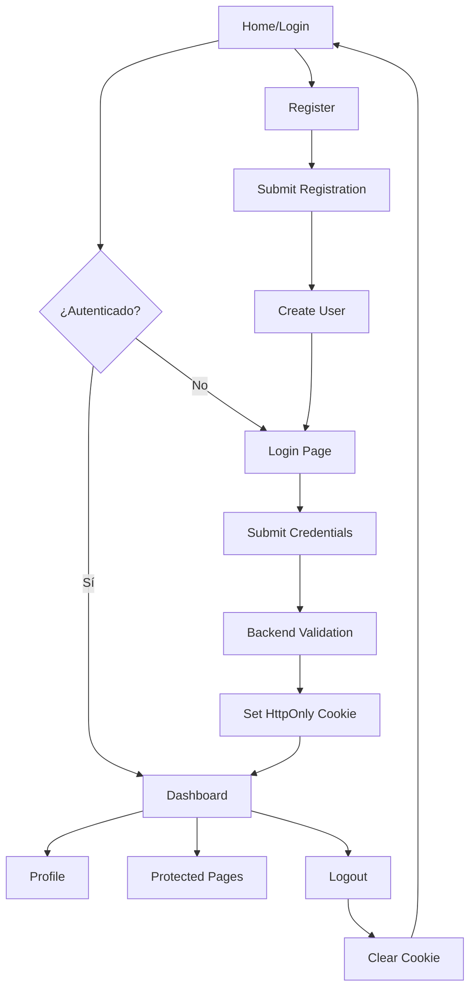

## 1. Product Overview
Frontend Vue.js independiente para autenticación mediante cookies HTTP. Proporciona una interfaz moderna y segura para gestión de usuarios con tokens almacenados exclusivamente en cookies.
- Resuelve problemas de seguridad al evitar el almacenamiento de tokens en localStorage
- Permite implementación de autenticación stateless con cookies HttpOnly
- Target: Aplicaciones web modernas que requieren autenticación segura

## 2. Core Features

### 2.1 User Roles
| Role | Registration Method | Core Permissions |
|------|---------------------|------------------|
| Guest User | No registration required | Puede ver páginas públicas, acceder a login/register |
| Authenticated User | Email/password registration | Acceso a páginas protegidas, gestión de perfil |
| Admin User | Designación manual/upgrade | Acceso a panel de administración |

### 2.2 Feature Module
Nuestro frontend Vue consiste en las siguientes páginas principales:
1. **Login page**: Formulario de autenticación, validación de credenciales.
2. **Register page**: Formulario de registro, validación de datos.
3. **Dashboard page**: Panel principal post-autenticación, información del usuario.
4. **Profile page**: Gestión de perfil de usuario, actualización de datos.
5. **Protected page**: Ejemplo de página protegida que requiere autenticación.

### 2.3 Page Details
| Page Name | Module Name | Feature description |
|-----------|-------------|---------------------|
| Login page | Authentication form | Validar credenciales, enviar credenciales por POST, manejar errores de autenticación, redirigir a dashboard tras login exitoso. |
| Login page | Cookie handler | Recibir y almacenar cookie HttpOnly del servidor, gestionar expiración automática. |
| Register page | Registration form | Capturar email, contraseña, nombre, validar formato email, confirmación de contraseña. |
| Register page | User creation | Enviar datos al servidor, manejar respuestas de éxito/error, redirigir a login. |
| Dashboard page | User info display | Mostrar nombre y email del usuario autenticado, cargar datos desde API protegida. |
| Dashboard page | Navigation menu | Incluir enlaces a perfil, logout, páginas protegidas, indicador de estado de autenticación. |
| Profile page | Profile form | Mostrar datos actuales del usuario, permitir edición de nombre y email. |
| Profile page | Update handler | Enviar cambios al servidor, validar datos, mostrar confirmación de cambios. |
| Protected page | Access control | Verificar cookie de autenticación antes de renderizar, redirigir a login si no autenticado. |
| Protected page | Content display | Mostrar contenido exclusivo para usuarios autenticados, cargar datos de API protegida. |
| Global | Route guards | Implementar guards en Vue Router para proteger rutas, verificar autenticación antes de navegación. |
| Global | API interceptor | Agregar cookie automáticamente a requests, manejar errores 401/403, redirigir a login. |
| Global | Logout handler | Limpiar estado local, llamar endpoint de logout del servidor, redirigir a página pública. |

## 3. Core Process

### User Authentication Flow
1. Usuario accede a la aplicación
2. Si intenta acceder a ruta protegida, se verifica autenticación
3. Si no está autenticado, se redirige a login
4. Usuario ingresa credenciales
5. Frontend envía POST con credenciales al backend
6. Backend valida y envía cookie HttpOnly
7. Frontend almacena cookie automáticamente
8. Usuario navega a páginas protegidas con cookie incluida automáticamente
9. Al cerrar sesión, se llama endpoint logout y se limpia cookie

### Registration Flow
1. Usuario accede a página de registro
2. Completa formulario con datos requeridos
3. Frontend valida formato y coincidencia de contraseñas
4. Envía datos al endpoint de registro
5. Maneja respuesta de éxito o error
6. Redirige a login en caso de éxito

## 4. User Interface Design

### 4.1 Design Style
- **Colores primarios**: Azul oscuro (#1a365d), Blanco (#ffffff)
- **Colores secundarios**: Azul claro (#63b3ed), Gris claro (#f7fafc)
- **Estilo de botones**: Bordes redondeados (8px), sombra sutil
- **Tipografía**: Inter o similar, tamaños base 16px
- **Layout**: Card-based con navegación superior
- **Iconos**: SVG modernos, minimalistas

### 4.2 Page Design Overview
| Page Name | Module Name | UI Elements |
|------------|-------------|-------------|
| Login page | Form container | Card centrado (400px), fondo gradiente suave, logo en cabecera, campos con iconos, botón principal prominente. |
| Login page | Error display | Alert rojo suave para errores, mensajes claros de validación, animación de shake en caso de error. |
| Register page | Form container | Mismo estilo que login, campos adicionales para nombre, campo de confirmación de contraseña con validación visual. |
| Dashboard page | User header | Barra superior con nombre de usuario, avatar placeholder, menú desplegable con opciones de perfil y logout. |
| Dashboard page | Main content | Grid de cards con estadísticas o información relevante, tipografía clara y jerárquica. |
| Profile page | Profile card | Formulario en card centrado, campos prellenados, botón de guardar con estado de carga. |
| Protected page | Content area | Área principal con mensaje de bienvenida personalizado, contenido específico del rol del usuario. |

### 4.3 Responsiveness
- **Desktop-first**: Diseño optimizado para pantallas grandes (1200px+)
- **Mobile-adaptive**: Breakpoints en 768px y 480px
- **Touch optimization**: Botones mínimo 44px, espaciado adecuado para touch
- **Componentes responsivos**: Cards que se adaptan de 4 a 1 columna

### 4.4 Security Considerations
- No almacenar tokens en localStorage o sessionStorage
- Usar cookies HttpOnly y Secure en producción
- Implementar CSRF protection tokens
- Validación de entrada en frontend y backend
- HTTPS obligatorio en producción